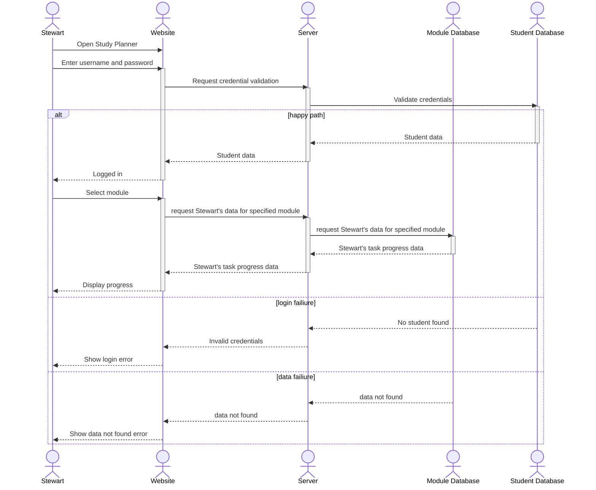
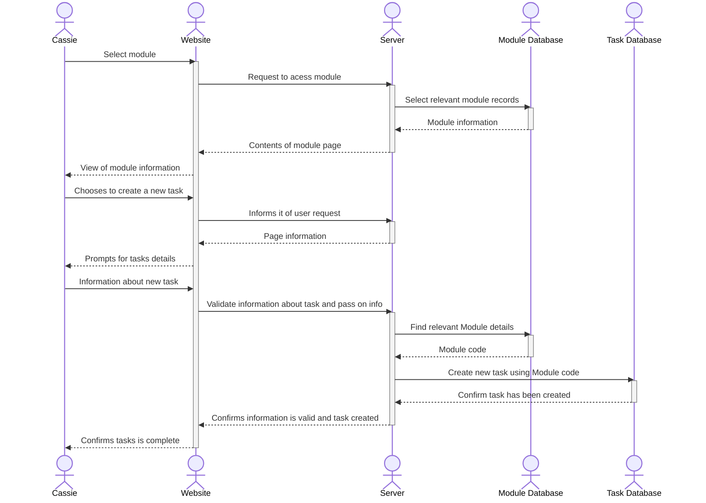
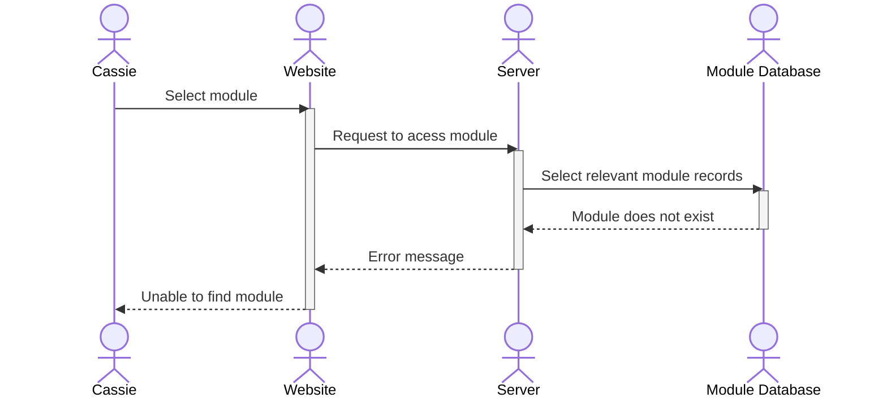

**1C - Stewart tracks progress **

```mermaid
sequenceDiagram
  actor Stewart
  actor Website
  actor Server
  actor Module Database
  actor Student Database
  Stewart->>Website: Open Study Planner
  Stewart->>Website: Enter username and password
  activate Website
  Website->>Server: Request credential validation
  activate Server
  Server->>Student Database: Validate credentials
  activate Student Database
  alt happy path
    Student Database -->> Server: Student data
    deactivate Student Database
    Server -->> Website: Student data
    deactivate Server
    Website -->> Stewart: Logged in
    deactivate Website
    Stewart ->> Website: Select module
    activate Website
    Website ->> Server: request Stewart's data for specified module
    activate Server
    Server ->> Module Database: request Stewart's data for specified module
    activate Module Database
    Module Database -->> Server: Stewart's task progress data
    deactivate Module Database
    Server -->> Website: Stewart's task progress data
    deactivate Server
    Website -->> Stewart: Display progress
    deactivate Website
  else login failiure
    Student Database -->> Server: No student found
    Server -->> Website: Invalid credentials
    Website -->> Stewart: Show login error
  else data failiure
    Module Database -->> Server: data not found
    Server -->> Website: data not found
    Website -->> Stewart: Show data not found error
  end

  
```

**2C - Cassie creates a task - Sucess Path**

```mermaid
sequenceDiagram
  actor Cassie
  actor Website
  actor Server
  actor Module Database
  actor Task Database
  Cassie->>Website: Select module
  activate Website
  Website->>Server: Request to acess module
  activate Server
  Server->>Module Database: Select relevant module records
  activate Module Database
  Module Database-->>Server: Module information
  deactivate Module Database
  Server-->>Website: Contents of module page
  deactivate Server
  Website-->>Cassie: View of module information
  Cassie->>Website: Chooses to create a new task
  Website->>Server: Informs it of user request
  activate Server
  Server-->>Website: Page information
  deactivate Server
  Website-->>Cassie: Prompts for tasks details
  Cassie->>Website: Information about new task
  Website->>Server: Validate information about task and pass on info
  activate Server
  Server->>Module Database: Find relevant Module details
  activate Module Database
  Module Database-->>Server: Module code
  deactivate Module Database
  Server->>Task Database: Create new task using Module code
  activate Task Database
  Task Database-->> Server: Confirm task has been created
  deactivate Task Database
  Server-->>Website: Confirms information is valid and task created
  deactivate Server
  Website-->>Cassie: Confirms tasks is complete
  deactivate Website
```
**2C - Cassie creates a task - Failure Path**

```mermaid
sequenceDiagram
  actor Cassie
  actor Website
  actor Server
  actor Module Database
  Cassie->>Website: Select module
  activate Website
  Website->>Server: Request to acess module
  activate Server
  Server->>Module Database: Select relevant module records
  activate Module Database
  Module Database-->>Server: Module does not exist
  deactivate Module Database
  Server-->>Website: Error message
  deactivate Server
  Website-->>Cassie: Unable to find module
  deactivate Website
```
