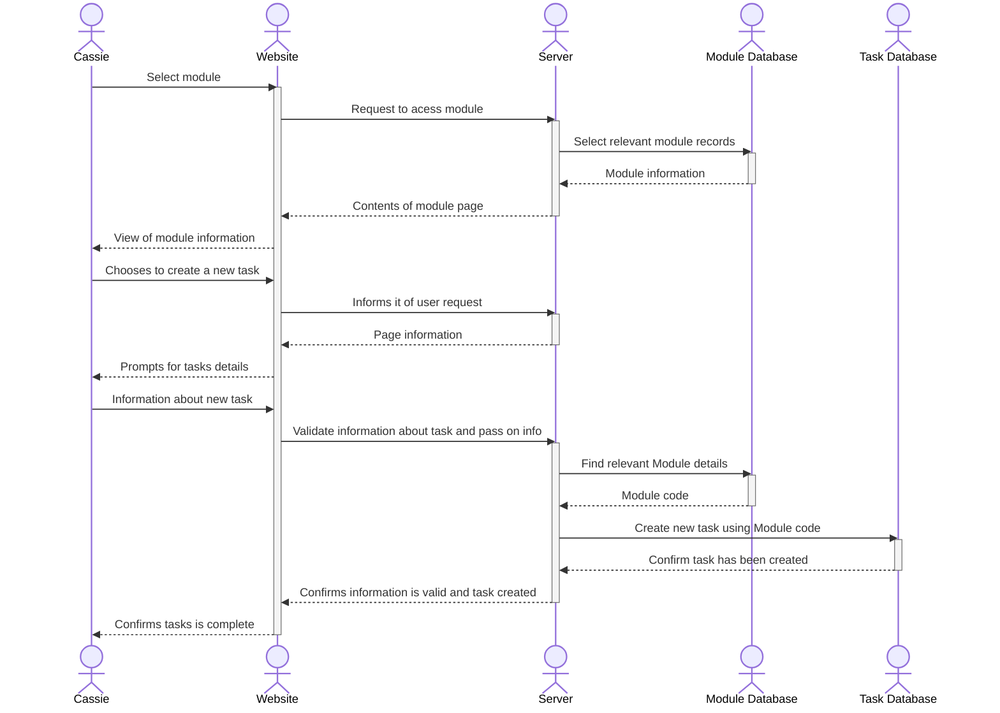

**Stewart does **

**2C - Cassie creates a task - Sucess Path**

```mermaid
sequenceDiagram
  actor Cassie
  actor Website
  actor Server
  actor Module Database
  actor Task Database
  Cassie->>Website: Select module
  activate Website
  Website->>Server: Request to acess module
  activate Server
  Server->>Module Database: Select relevant module records
  activate Module Database
  Module Database-->>Server: Module information
  deactivate Module Database
  Server-->>Website: Contents of module page
  deactivate Server
  Website-->>Cassie: View of module information
  Cassie->>Website: Chooses to create a new task
  Website->>Server: Informs it of user request
  activate Server
  Server-->>Website: Page information
  deactivate Server
  Website-->>Cassie: Prompts for tasks details
  Cassie->>Website: Information about new task
  Website->>Server: Validate information about task and pass on info
  activate Server
  Server->>Module Database: Find relevant Module details
  activate Module Database
  Module Database-->>Server: Module code
  deactivate Module Database
  Server->>Task Database: Create new task using Module code
  activate Task Database
  Task Database-->> Server: Confirm task has been created
  deactivate Task Database
  Server-->>Website: Confirms information is valid and task created
  deactivate Server
  Website-->>Cassie: Confirms tasks is complete
  deactivate Website

```
